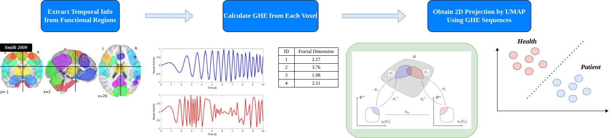

# A Bio marker using Topological Machine Learning of rs-fMRI

Submitted to Elsevier Neuroscience

#### Required Packages
1. numpy
2. umap
3. nilearn

#### Copyright Notice:
Corresponding Author: Yongming Liu yongming.liu@asu.edu \
Prognostic Analysis and Reliability Assessment Lab, Arizona State University. https://paralab.engineering.asu.edu/
